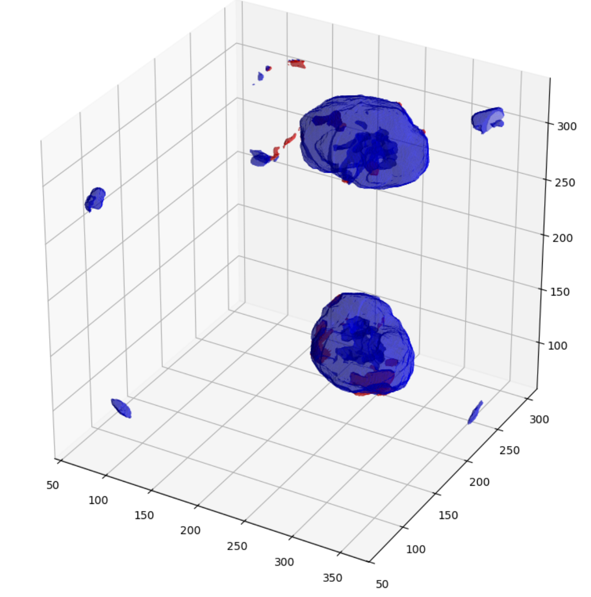

# computer-vision-project

This is the mid-term project for the Computer Vision Subject. The Project is to perform semantic segmentation on 3D CT images scan of kidney tumor. The result can be seen as follow:

